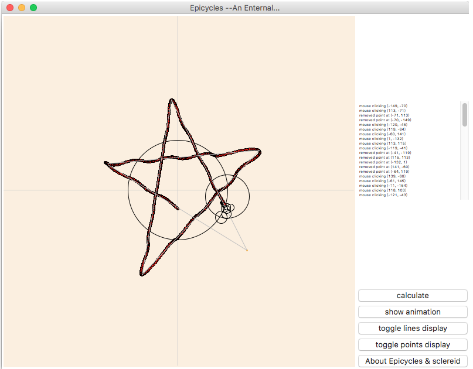

Epicycles
============

A small program to display epicycles with given image.

About *deferent and epicycle*: <https://en.wikipedia.org/wiki/Deferent_and_epicycle>

Inspired by this article: *[The Mathematical Power of Epicyclical Astronomy](http://www.u.arizona.edu/%7Eaversa/scholastic/Mathematical%20Power%20of%20Epicyclical%20Astronomy%20%28Hanson%29.pdf) *

> In the Hipparchian and Ptolemaic systems of astronomy, the epicycle (from Ancient Greek: ἐπίκυκλος, literally on the circle, meaning circle moving on another circle) was a geometric model used to explain the variations in speed and direction of the apparent motion of the Moon, Sun, and planets. In particular it explained the apparent retrograde motion of the five planets known at the time. Secondarily, it also explained changes in the apparent distances of the planets from Earth.

### Status:

***Improving***

More Features:
------------

**better interaction with users:**

* [x] allow using a background picture
* [x] more user defined variables
* [ ] colorful background
* [ ] better tracers
* [ ] export as animated gif

**create delicate epicycles:**

* [ ] <s>use fourier series instead of discrete fourier transform</s>
* [x] use both clockwise and counterclockwise rotations (suggested by [zzytyy](https://github.com/zzyztyy))

**documentation:**
* [ ] write some doc about its principles

Note:
-----------

This is a GPL Licensed version. See [LICENSE.md](LICENSE.md) for more information.

### Usage:

If you are running from the source, you should install [python](https://www.python.org), [numpy](http://www.numpy.org) and [scipy](http://www.scipy.org) in advance.

Download from the releases or run the source file in python. Should be simple enough.

Have fun!
